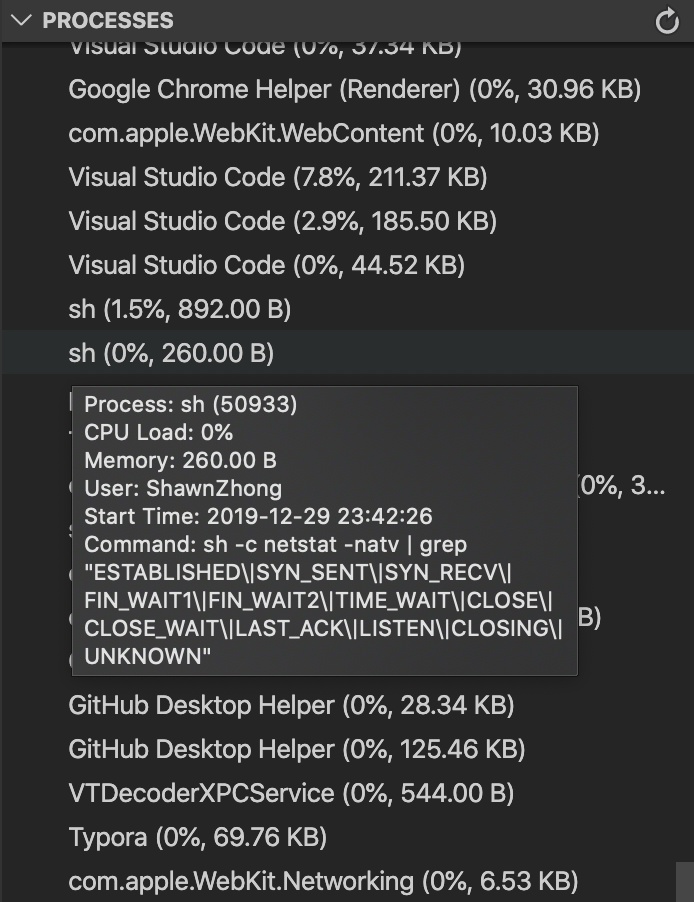

# Task Manager & Resource Monitor

## Installation

Install through VS Code extensions. Search for `Task Manager & Resource Monitor`

[Visual Studio Code Market Place: Task Manager & Resource Monitor](https://marketplace.visualstudio.com/items?itemName=shawnzhong.system-task-manager)

Can also be installed in VS Code: Launch VS Code Quick Open (Ctrl+P), paste the following command, and press enter.

```
ext install shawnzhong.system-task-manager
```

## Features

|                       Manage Processes                       |                       Check Port Usage                       |
| :----------------------------------------------------------: | :----------------------------------------------------------: |
|  |  |